# NeuroCast

[](https://github.com/neurocast-iot/server/blob/main/LICENSE)
[](https://openjdk.org/)
[](https://spring.io/projects/spring-boot)
[](https://webrtc.org/)

开源 IoT 设备管理平台，以 **WebRTC** 为核心实时视频方案，实现从设备端到浏览器的亚秒级低延迟直播。

## 🖥️ 界面预览

### 仪表盘

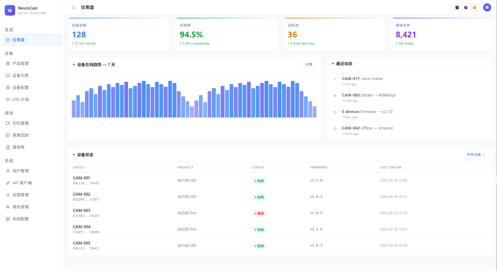

### 实时监控

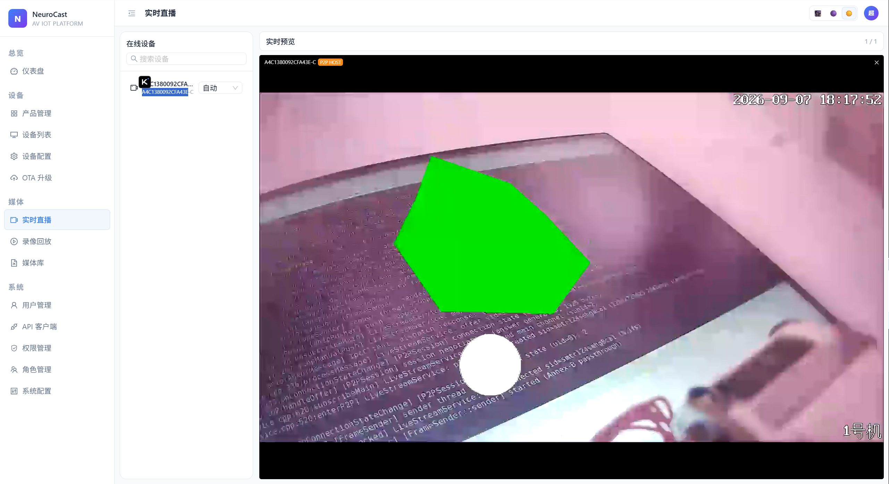

### 设备列表

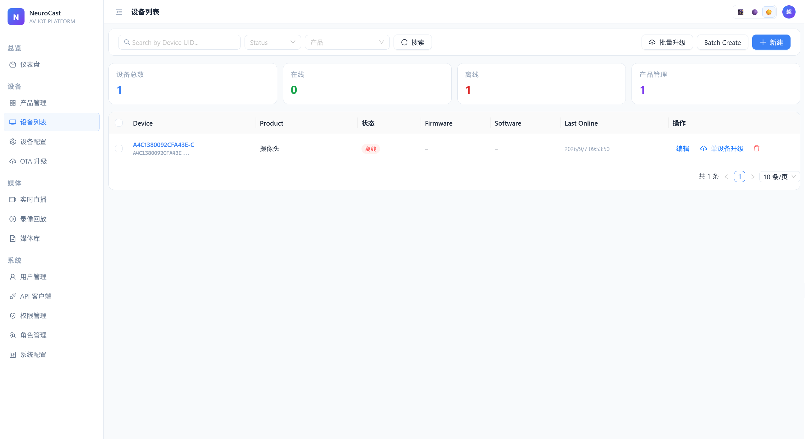

> 更多界面截图见 [管理平台界面展示](#管理平台界面展示)

## ✨ 核心特性

- **设备管理**：设备 CRUD、批量创建、产品管理（设备类型）
- **设备配置**：通过 ThingsBoard SHARED_SCOPE 下发配置，支持视频参数、抓拍参数、OSD 水印
- **远程控制**：FRP 内网穿透、SSH 隧道、设备重启/复位
- **实时流媒体**：基于 SRS 的 WebRTC 实时推流（P2P/SFU）、HTTP-FLV 直播、HLS 回放
- **触发器配置**：定时抓拍、录像、蓝牙标签等事件触发器
- **权限管理**：基于 RBAC 的用户/角色/权限管理
- **API 客户端**：支持 API Key 认证的客户端管理

##  为什么选 NeuroCast

| | 传统 IP 摄像头 | NeuroCast |
|---|---|---|
| 推流协议 | RTSP / 私有协议 | **WebRTC**（P2P + SFU） |
| 浏览器观看 | 需插件或转码服务器 | **原生支持，零安装** |
| 延迟 | 1-5 秒（转码后更高） | **亚秒级** |
| 移动端 | 需专用 App | **H5 页面直接看** |
| NAT 穿透 | 基本没有 | **Full-ICE + STUN/TURN** |
| 多人观看 | 需流媒体服务器转码 | **SFU 模式（WHIP/WHEP）原生支持** |

NeuroCast 以 WebRTC 为核心，打通 **设备端推流 → 服务端信令转发 → 前端浏览器播放** 全链路，无需任何插件或转码服务，浏览器原生即可实现亚秒级实时观看。

## 🏗️ 系统架构

```
┌─────────────┐     MQTT      ┌──────────────┐
│   设备端     │◄─────────────►│ ThingsBoard  │
│  (firmware)  │               │  (IoT 平台)   │
│  WebRTC 推流  │               └──────┬───────┘
└──────┬───────┘                      │ 规则引擎
       │ WebRTC P2P/SFU               │ HTTP 回调
       ▼                              ▼
┌──────────────┐              ┌───────────────┐
│     SRS      │              │ NeuroCast     │
│  (流媒体)    │◄────────────►│   Server      │
│  WHIP/WHEP   │   REST API   │  (Spring Boot)│
└──────┬───────              └───────┬───────┘
       │                              │
       │ WebRTC / HTTP-FLV / HLS      │ PostgreSQL
       ▼                              │ Redis
──────────────┐                      ▼
│  Web 管理平台  │              ┌───────────────┐
│  (platform)   │              │  数据存储       │
│  WebRTC 播放器 │              └───────────────┘
└──────────────┘
```

**技术栈**：Java 21 / Spring Boot 3.x / PostgreSQL / Redis / ThingsBoard / SRS（WebRTC SFU） / MyBatis-Plus

## 📚 文档导航

### 服务端

| 文档 | 说明 |
|------|------|
| [系统架构](cn/server/architecture.md) | 系统概述、功能模块、技术栈、认证机制 |
| [API 概览](cn/server/api/overview.md) | 认证方式、统一响应格式、错误码总表 |
| [OSD 水印配置协议](cn/server/protocol/osd_elements_config_api.md) | OSD 水印配置 API（云端→设备） |
| [事件触发器配置协议](cn/server/protocol/triggers_config_api.md) | 触发器自动化配置（定时器、蓝牙、录像） |

### 固件端

| 文档 | 说明 |
|------|------|
| [固件架构](cn/firmware/architecture.md) | 分层架构、进程模型、IPC 通信、平台抽象 |
| [mediad API](cn/firmware/api/mediad-api.md) | 媒体守护进程 — 相机、录像、推流、OSD、触发器 |
| [iot_agent API](cn/firmware/api/iot-agent-api.md) | 云端代理 — MQTT、配置同步、OTA、文件上传、RPC |
| [IPC 通信协议](cn/firmware/api/ipc-protocol.md) | 进程间通信协议（ZeroMQ） |
| [WebRTC 推流](cn/firmware/guides/webrtc-streaming.md) | P2P/SFU 模式、MQTT 信令、WHIP/WHEP 协议 |
| [配置参考](cn/firmware/guides/config-reference.md) | 全部配置项说明（mediad.json、iot_agent.json） |

### 管理平台界面展示

**设备管理**

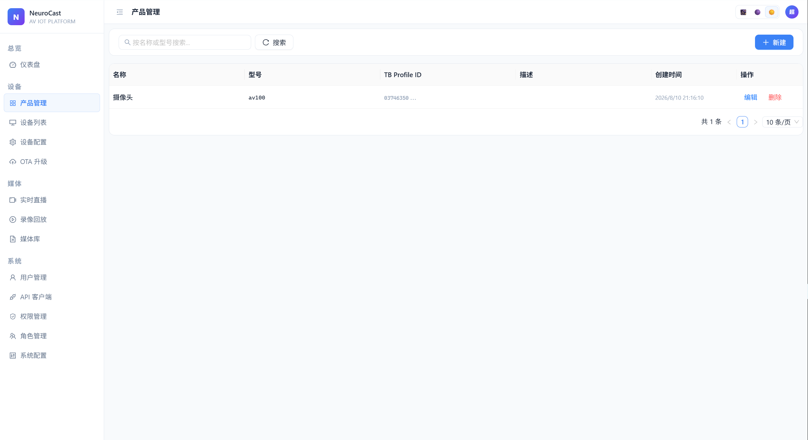


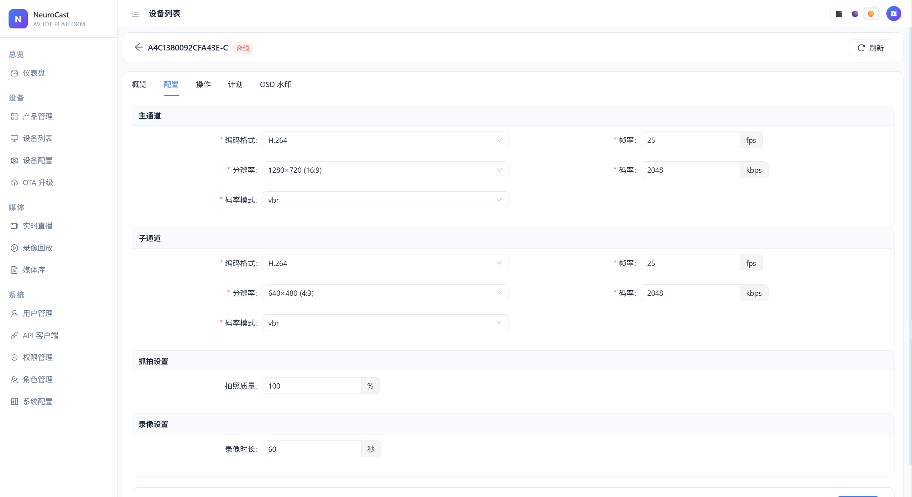

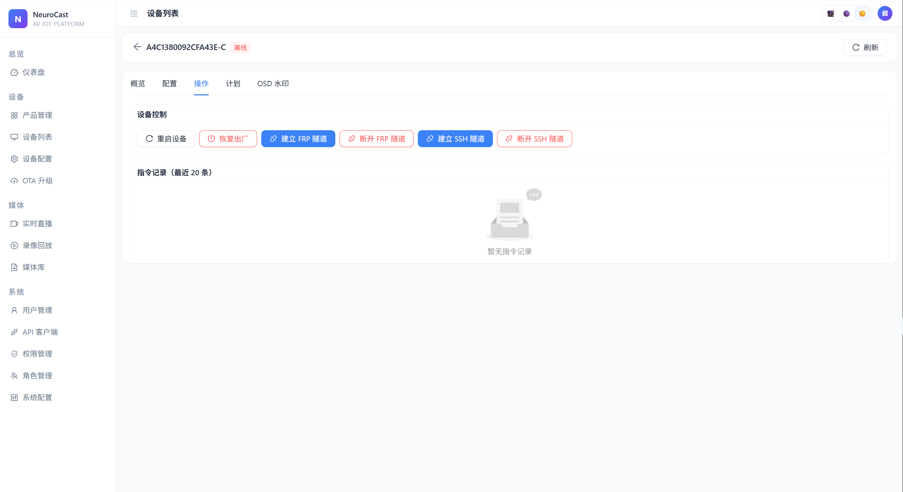

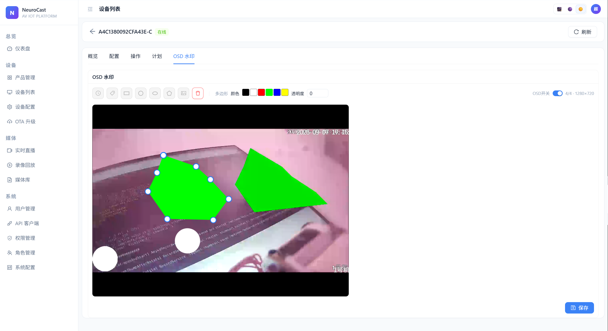

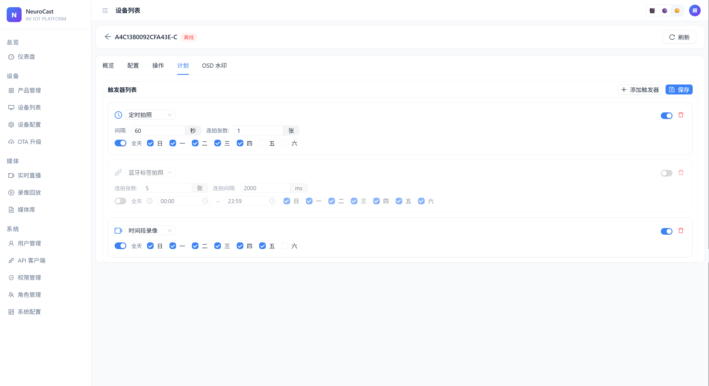

**实时直播与回放**


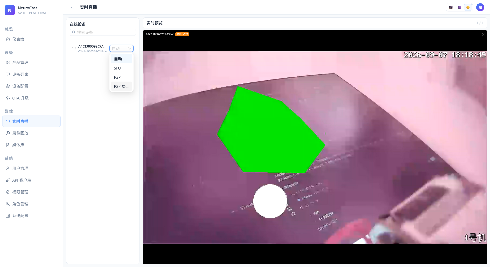

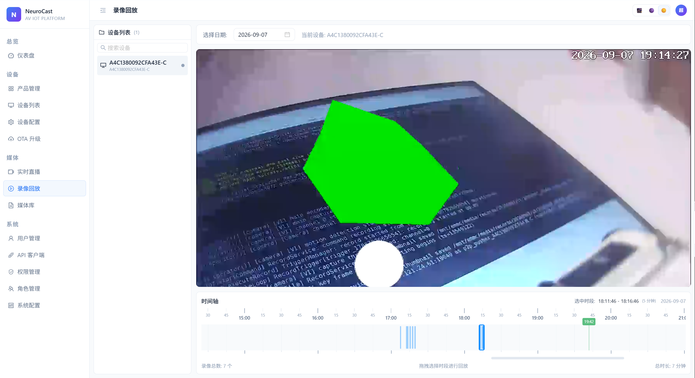

**媒体库**

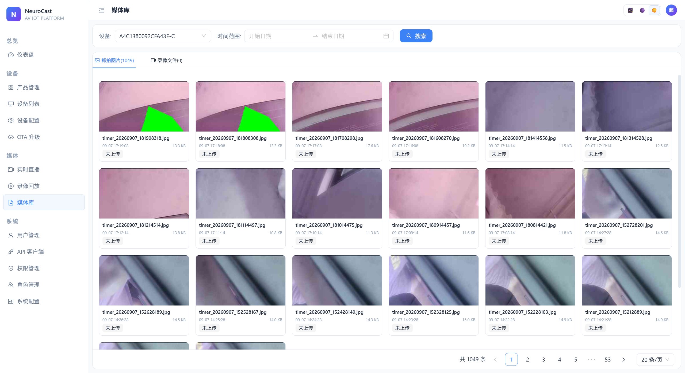

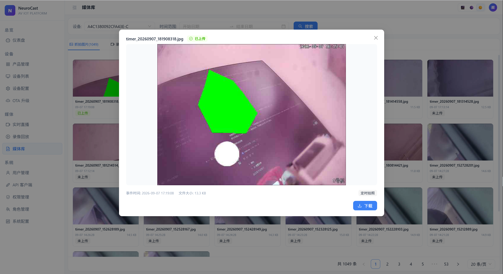

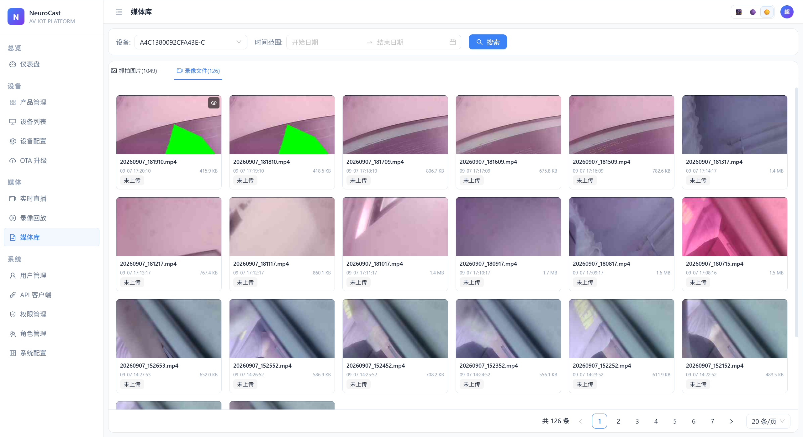

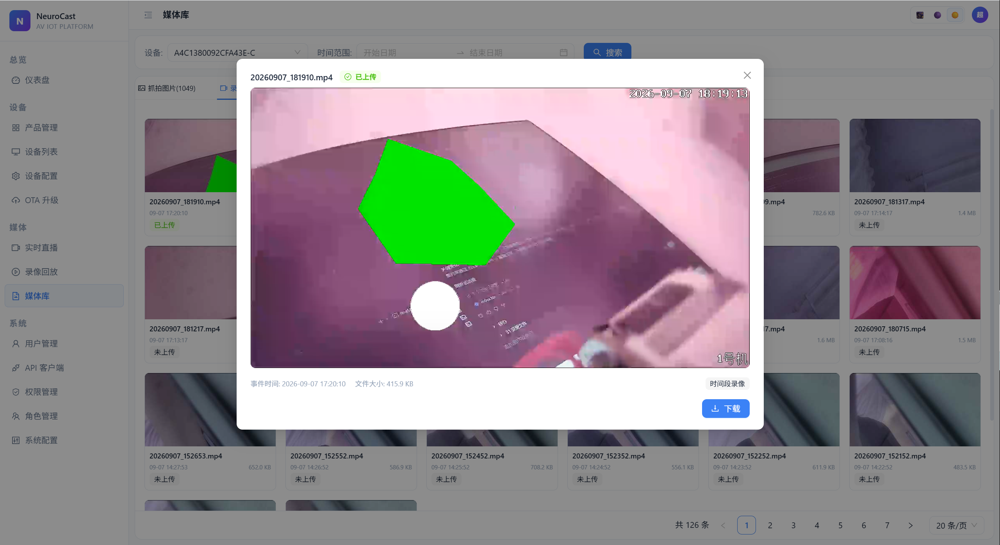

**系统管理**

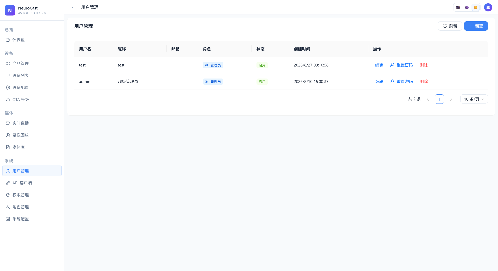

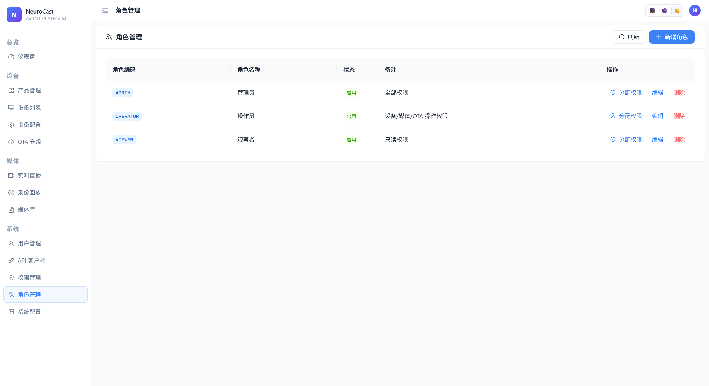

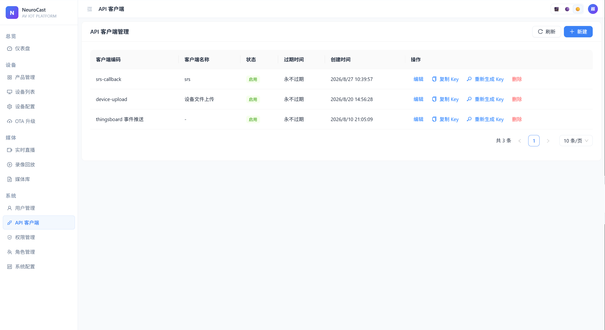

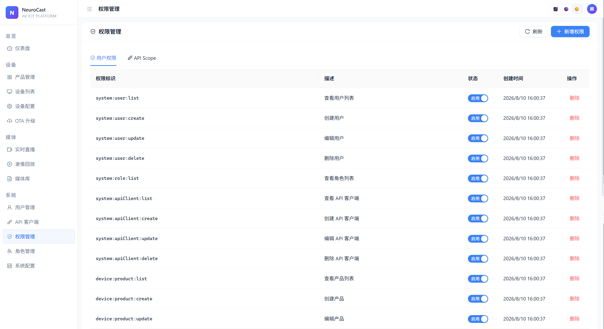

## 📦 相关仓库

| 仓库 | 说明 |
|------|------|
| [neurocast-iot/server](https://github.com/neurocast-iot/server) | 服务端源码（Java / Spring Boot） |
| [neurocast-iot/firmware](https://github.com/neurocast-iot/firmware) | 设备端固件（C++ / WebRTC） |
| [neurocast-iot/platform](https://github.com/neurocast-iot/platform) | Web 管理平台（前端 / WebRTC 播放器） |
| [neurocast-iot/docs](https://github.com/neurocast-iot/docs) | 项目文档（本仓库） |

##  许可证

本项目采用 [Apache License 2.0](https://github.com/neurocast-iot/server/blob/main/LICENSE) 许可证。
